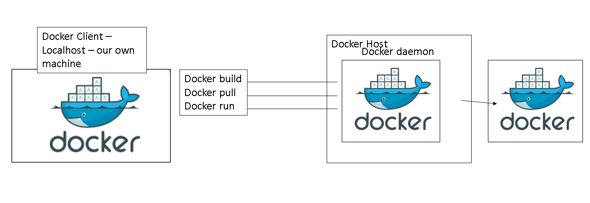

# Containerisation with Docker
## what is Docker?
- Docker is an open-souce platform  **docker hub documentation**
- it helps and enables us to seperate applications from the infrastructure
- it allows us to deliver software faster
- Docker is written in GO language
### why Docker?
- multi billion dollar companies are using or adapting Docker, e.g Ebay, Netflix
- docker adoption is anticipated by 50% by the end of 2020
### Demand and future of Docker
### Docker API

### What is the difference bwtween VM and Docker?
- Docker is light-weight and user friendly 
- Docker shares the resources of OS as opposed to using the OS completely
- Docker engine connects the container with OS and only use the resources required
- Vm works with Hyperviser
 
# Docker commands:
```bash
# pulling an image
docker pull name_of_image

# running an image (does 'pull' too if you haven't)
docker run name_of_image

# build container from image
docker build -t name_of_image

# commit to repo 
docker commit name_of_image/container-id


docker start container-id
docker stop rm cotainer-id/name
docker ps and ps -a # to check existing containers

# logging into container
docker exec -it name_of_container/id

```


# Docker 



## Difference between removing and stopping 
- if you remove it the data is gone 
- if you stop it it's just 'paused' 

# On Windows
```bash
 alias docker="winpty docker"
```

## Log into container

```bash
#launch nginx on port 99
docker run -d -p 99:80 nginx
docker exec -it <container_id> bash

# from here we can find the nginx conf files, for example, and make changes to them 
cd /usr/share/nginx/html
apt update
apt install nano 
nano index.html

# make necessary edits, then CTRL X, Y, ENTER
# you can then exit the machine 
exit

# and refresh the page, you will be able to see any changes you made to the index.html file
# in real time
```

__Interview: How can you change the configuration of the container?__
By *logging in* to the container


# Task 
Change nginx homepage without going into the container. 
```/usr/share/nginx/html```

__complete the task with the docker copy command.__

```bash
# the command is:
docker cp your_file container_id:location_in_container
# in this case
docker cp index.html 4f959204d03f:usr/share/nginx/html
```

# Repository Management
```bash
docker commit <container_id> <user>/<repo_name>
>sha256:58931a6e51deb7281709930b959cb7146f5b4313223269864519ff7cc20935dd
```
```bash
# check that there is an image of your container /repo 
docker images 
```
```bash
# to push to your repo
docker push <user>/<repo_name>
# in this case:
#docker push farahmh/containerisation_docker
```
```bash
# If you get access denied just type 
docker login 
# and enter your username and password
```
